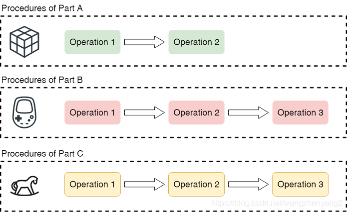
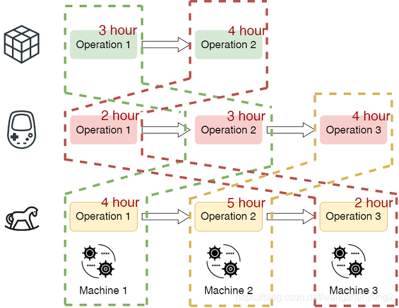
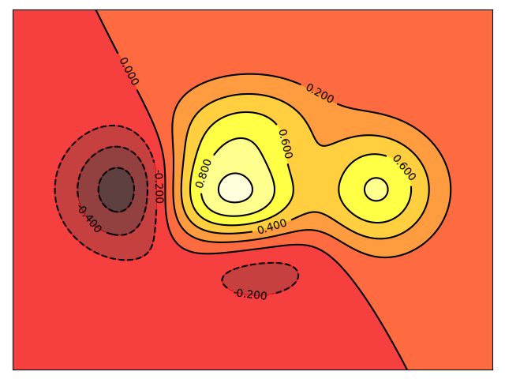

# Job Shop Problem Brief

- Job-shop Scheduling Problem (JSP) is a scheduling problem in manufacturing process planning and management. In this problem, a set of machines needs to process a set of workpieces. Each workpiece is formed by a series of processes with sequential constraints. Each process requires only one machine. The machine is always available and can process one operation at a time without interruption. Decisions include how to sequence the processes on the machine to optimize a given performance metric. A typical performance indicator of JSP is the completion time (Makespan), that is, the time required to complete all the work. In computer science, the job shop scheduling problem is considered to be a very strong NP-hard problem.

- Problem Description

  - Given n workpieces {J1, J2, ..., Jn}, to be machined on m machines {M1, M2, ..., Mm}. The processing of each workpiece needs to go through the corresponding process {O1, O2, ..., Om}. These operations correspond to the use of different machines.
  - Constraints on the workpiece: The process on each workpiece can only start the next process after the execution of the previous process is completed.
  - Constraints on the machine: each machine can only execute at most one workpiece at a time, and the process is not preempted during execution.
  - Given the process that each workpiece needs to go through, and the time required for each process, find a machine scheduling scheme that minimizes the total processing time (Makespan).

- Examples

  

  

# Taboo search

## Algorithmic ideas

Mark the local optima or solution processes that have been solved and avoid these local optima or solution processes in further iterations. The disadvantage of local search is that it searches too much for a local area and its neighborhood, which leads to blindness. In order to find the global optimal solution, tabu search is to consciously avoid a part of the local optimal solution found, so as to obtain more search areas.

Looking at the picture, if we find a local optimal solution during the search process, then our next search must consciously avoid the search direction of this solution (fill this direction into the taboo table), so that in It can jump out of the local optimum and at the same time obtain more search areas, and can find a relatively optimal solution.

## Algorithm elements

- Solution construction: Encoding specific forms of solutions for specific problems
- Domain move: get valid neighbor solution by current solution
- Evaluation function: solution value, judge the pros and cons of the solution, and directly affect the next search direction
- Taboo list:
  - Taboo objects: The taboo table is restricted by constraining the solution of objects with a certain characteristic, neighbors moving in this direction. Neighboring solutions related to a solution of an optimal solution are restricted.
  - Taboo length: how many iterations the taboo object will be released after.
    - Taboo object and taboo length determine the quality of taboo search. If the taboo object is not accurate enough, that is, the direction of the taboo search is not accurate enough or the tabu length is too small, the ability of the algorithm to avoid entering the local optimum will be limited
    - If the tabu length is too large and the search area is limited, it is possible to jump out of the local optimum and not be able to move to the next optimum, and good solutions may be skipped.
  - Rules for breaking the taboo: For solutions with a certain structure or feature, you can defy the taboo rules and get amnesty.
- stop criteria
  - Maximum number of iterations, algorithm running time, no solution or combination strategy can be improved within a given number of iterations.

## Tabu search applied to JSP

- Coding solution:
  - Machine constraints on workpieces: For a certain machine, it stores a scheduling table and specifies the sequence number of the workpiece to be executed next. The machine has strict requirements on the sequence number of the workpiece.
    - There is a problem of deadlock: the machine requests the workpiece, and the workpiece requests the machine, which causes the deadlock to go no further, and the Makespan is infinite. This solution is invalid, and the occurrence of deadlock needs to be detected
  - Priority of machine to workpiece: For a certain machine, it stores a priority table, and does not strictly specify the next workpiece. For machines that have arrived and waited, the next workpiece to be executed is selected according to the priority (code used in this project)
    - This contains a little greedy approach: try not to stop the machine as much as possible, and execute as long as there are artifacts in the waiting queue
    - Problem: Although it is intuitive to shrink the Makespan without stopping the machine as much as possible, it is not guaranteed. Some possible schedules may be missed, the solution space is incomplete, and the optimal solution may also be included
    - Even so, the size of the solution space for a 10*10 use case is (10!)^10 ≈ 4*10^65, which is enough to search
  - Execution order of serialized artifacts:
    - Used by other members of the group, which is great. It will not deadlock and will not reduce the solution space, which is more reasonable.
- Neighborhood movement
  - Neighbor operator: randomly select a machine, randomly select two workpieces of this machine to exchange priority values
  - The number of neighbors: too small, the solution is difficult to improve or not improved, and the convergence is too slow. If it is too large, the computational cost will be too high, and if the movement is too slow, the convergence will be slow. It is set to m*n here, and it is hoped that every neighbor, every machine and every workpiece found every time can participate in the change.
    - You can also do experiments to verify the influence of the number of neighbors on the solution
- Evaluation function: Calculate the Makespan under the current solution
- Taboo table design:
  - Taboo objects:
    - Taboo-tuned machine / Taboo-tuned workpiece (coarse-grained)
    - 2-tuple (medium granularity) of taboo (machine-artifact)
    - triples (fine-grained) of taboo (machine-artifact1-artifact2)
  - Taboo length
    - 10
    - 50
    - 100
    - 500
    - 1000
  - Forbidden rule: When a forbidden movement can obtain better than the optimal neighborhood solution obtained by the non-forbidden movement and the optimal solution obtained by history, the algorithm should accept the movement without being restricted by the taboo table . Make sure that the algorithm can search for the local optimum before jumping out of the current solution domain.
- stop criteria
  - 10*10 solution space size (10!)^10 according to the scale of the use case used in the experiment
  - Iteration limit: 100000
  - The upper limit of iteration that cannot be improved: 1000, after finding the local optimum, it will give you so long to jump out of the local optimum to find the next better solution, and stop if you cannot find it

- Algorithmic process

  

- Experimental effect

  - Experimental effects under different taboo table designs
    - Taboo objects
      - Use case ft06, use case abz5
      - The fine-grained update is not very vigorous, the iteration is slow but the better value can be found
      - Coarse-grained updates are powerful each time, the iteration is fast (a better solution will not be found soon), and the solution found is relatively low
    - Taboo length
      - Use case ft10
  - How many iterations can it converge after
  - The influence of the selection of the number of neighbors on the convergence speed
    - Use case la16
  - The process of a search, the change of the optimal solution, the convergence situation, whether the optimal solution is found
  - Performance under multiple use cases
    - Optimal performance for five use cases
  - Comparison of search capability with local search after parameters are determined
    - the quality of the solution
    - The number of iterations to find the optimal solution
    - search duration
  - How to dynamically display the search process

- insufficient

  - How to stop more rationally
  - the encoding of the solution cannot encompass the entire solution space
  - For the neighbor operator, the moving step size may be too small. Under the current coding, only two workpieces are exchanged, and the obtained solution value will often remain the same.

# Directory Structure

JOBSHOP

> instance: use case directory
>
> > jobshop1.txt: use case library
> >
> > jobshop2.txt: use case generation code
> >
> > ...
>
> pics: sample pictures
>
> tabuSearchExp: related experiment records
>
> JSP-tabuSearch.py: main implementation program
>
> ganttBar.json: the json file used to draw the Gantt chart

# requirements

python3

matplotlib

# use

Enter in the terminal: python3 JSP-tabuSearch.py
